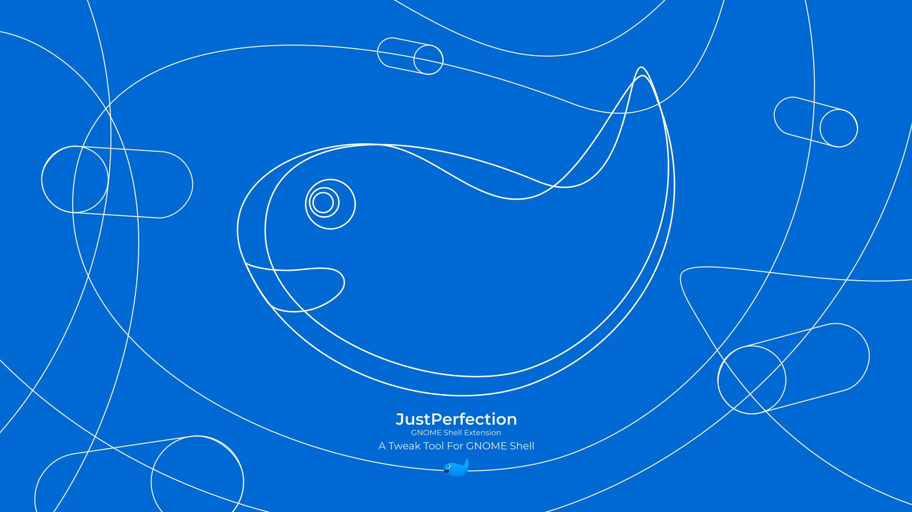

# Just Perfection GNOME Shell Extension



## Features

This extension allows you to do the following:

| Feature                                              | 3.36 | 3.38 | 40   | 41   | 42   | 43   | 44   | 45   | 46   | 47   | 48   |
| ---------------------------------------------------- | ---- | ---- | ---- | ---- | ---- | ---- | ---- | ---- | ---- | ---- | ---- |
| Accent Color for Icons                               |      |      |      |      |      |      |      |      |      | Yes  | Yes  |
| Accessibility Menu Visibility                        | Yes  | Yes  | Yes  | Yes  | Yes  | Yes  | Yes  | Yes  | Yes  | Yes  | Yes  |
| Activities Button Icon                               | Yes  | Yes  | Yes  | Yes  | Yes  | Yes  | Yes  |      |      |      |      |
| Activities button Visibility                         | Yes  | Yes  | Yes  | Yes  | Yes  | Yes  | Yes  | Yes  | Yes  | Yes  | Yes  |
| Alt Tab Icon Size                                    | Yes  | Yes  | Yes  | Yes  | Yes  | Yes  | Yes  | Yes  | Yes  | Yes  | Yes  |
| Alt Tab Window Preview Icon Size                     | Yes  | Yes  | Yes  | Yes  | Yes  | Yes  | Yes  | Yes  | Yes  | Yes  | Yes  |
| Alt Tab Window Preview Size                          | Yes  | Yes  | Yes  | Yes  | Yes  | Yes  | Yes  | Yes  | Yes  | Yes  | Yes  |
| Always Show Workspace Switcher on Dynamic Workspaces |      |      | Yes  | Yes  | Yes  | Yes  | Yes  | Yes  | Yes  | Yes  | Yes  |
| Animation Speed or Disable it                        | Yes  | Yes  | Yes  | Yes  | Yes  | Yes  | Yes  | Yes  | Yes  | Yes  | Yes  |
| App Gesture                                          | Yes  | Yes  |      |      |      |      |      |      |      |      |      |
| App Menu Icon Visibility                             | Yes  | Yes  | Yes  | Yes  | Yes  | Yes  | Yes  | Yes  | Yes  | Yes  | Yes  |
| App Menu Label Visibility                            | Yes  | Yes  | Yes  | Yes  | Yes  | Yes  | Yes  | Yes  | Yes  | Yes  | Yes  |
| App Menu Visibility                                  | Yes  | Yes  | Yes  | Yes  | Yes  | Yes  | Yes  | Yes  | Yes  | Yes  | Yes  |
| Applications Button Visibility                       | Yes  | Yes  | Yes  | Yes  | Yes  | Yes  | Yes  | Yes  | Yes  | Yes  | Yes  |
| Background Menu Visibility                           | Yes  | Yes  | Yes  | Yes  | Yes  | Yes  | Yes  | Yes  | Yes  | Yes  | Yes  |
| Calendar Visibility                                  | Yes  | Yes  | Yes  | Yes  | Yes  | Yes  | Yes  | Yes  | Yes  | Yes  | Yes  |
| Clock Menu Position                                  | Yes  | Yes  | Yes  | Yes  | Yes  | Yes  | Yes  | Yes  | Yes  | Yes  | Yes  |
| Clock Menu Visibility                                | Yes  | Yes  | Yes  | Yes  | Yes  | Yes  | Yes  | Yes  | Yes  | Yes  | Yes  |
| Dash App Running Dot Visibility                      |      |      |      |      | Yes  | Yes  | Yes  | Yes  | Yes  | Yes  | Yes  |
| Dash Icon Size                                       | Yes  | Yes  | Yes  | Yes  | Yes  | Yes  | Yes  | Yes  | Yes  | Yes  | Yes  |
| Dash Separator Visibility                            |      |      | Yes  | Yes  | Yes  | Yes  | Yes  | Yes  | Yes  | Yes  | Yes  |
| Dash Visibility                                      | Yes  | Yes  | Yes  | Yes  | Yes  | Yes  | Yes  | Yes  | Yes  | Yes  | Yes  |
| Disable Overlay Key                                  |      |      |      |      | Yes  | Yes  | Yes  | Yes  | Yes  | Yes  | Yes  |
| Disable Type to Search                               | Yes  | Yes  | Yes  | Yes  | Yes  | Yes  | Yes  | Yes  | Yes  | Yes  | Yes  |
| Double Super Key to App Grid                         |      |      | Yes  | Yes  | Yes  | Yes  | Yes  | Yes  | Yes  | Yes  | Yes  |
| Events in Clock Menu Visibility                      | Yes  | Yes  | Yes  | Yes  | Yes  | Yes  | Yes  | Yes  | Yes  | Yes  | Yes  |
| GNOME Shell Theme Override                           | Yes  | Yes  | Yes  | Yes  | Yes  | Yes  | Yes  | Yes  | Yes  | Yes  | Yes  |
| Hot Corner                                           | Yes  | Yes  | Yes  |      |      |      |      |      |      |      |      |
| Invert Calendar Column Items                         |      |      |      |      |      |      |      | Yes  | Yes  | Yes  | Yes  |
| Keyboard Layout Visibility                           | Yes  | Yes  | Yes  | Yes  | Yes  | Yes  | Yes  | Yes  | Yes  | Yes  | Yes  |
| Looking Glass Size                                   | Yes  | Yes  | Yes  | Yes  | Yes  | Yes  | Yes  | Yes  | Yes  | Yes  | Yes  |
| Maximum Displayed Search Results                     |      |      |      |      |      |      |      | Yes  | Yes  | Yes  | Yes  |
| Notification Banner Position                         | Yes  | Yes  | Yes  | Yes  | Yes  | Yes  | Yes  | Yes  | Yes  | Yes  | Yes  |
| OSD Position                                         |      |      |      |      | Yes  | Yes  | Yes  | Yes  | Yes  | Yes  | Yes  |
| OSD Visibility                                       | Yes  | Yes  | Yes  | Yes  | Yes  | Yes  | Yes  | Yes  | Yes  | Yes  | Yes  |
| Overview Spacing Size                                |      |      | Yes  | Yes  | Yes  | Yes  | Yes  | Yes  | Yes  | Yes  | Yes  |
| Panel Arrow Visibility                               | Yes  | Yes  |      |      |      |      |      |      |      |      |      |
| Panel Button Padding Size                            | Yes  | Yes  | Yes  | Yes  | Yes  | Yes  | Yes  | Yes  | Yes  | Yes  | Yes  |
| Panel Height                                         | Yes  | Yes  | Yes  | Yes  | Yes  | Yes  | Yes  | Yes  | Yes  | Yes  | Yes  |
| Panel icon size                                      | Yes  | Yes  | Yes  | Yes  | Yes  | Yes  | Yes  | Yes  | Yes  | Yes  | Yes  |
| Panel Indicator Padding Size                         | Yes  | Yes  | Yes  | Yes  | Yes  | Yes  | Yes  | Yes  | Yes  | Yes  | Yes  |
| Panel Notification icon Visibility                   | Yes  | Yes  | Yes  | Yes  | Yes  | Yes  | Yes  | Yes  | Yes  | Yes  | Yes  |
| Panel Position                                       | Yes  | Yes  | Yes  | Yes  | Yes  | Yes  | Yes  | Yes  | Yes  | Yes  | Yes  |
| Panel Round Corner Size                              | Yes  | Yes  | Yes  | Yes  |      |      |      |      |      |      |      |
| Panel Visibility                                     | Yes  | Yes  | Yes  | Yes  | Yes  | Yes  | Yes  | Yes  | Yes  | Yes  | Yes  |
| Panel Visibility in Overview                         | Yes  | Yes  | Yes  | Yes  | Yes  | Yes  | Yes  | Yes  | Yes  | Yes  | Yes  |
| Power Icon Visibility                                | Yes  | Yes  | Yes  | Yes  | Yes  | Yes  | Yes  | Yes  | Yes  | Yes  | Yes  |
| Quick Settings Airplane Mode Toggle Visibility       |      |      |      |      |      |      |      | Yes  | Yes  | Yes  | Yes  |
| Quick Settings Dark Mode Toggle Visibility           |      |      |      |      |      |      |      | Yes  | Yes  | Yes  | Yes  |
| Quick Settings Menu Visibility                       |      |      |      |      |      | Yes  | Yes  | Yes  | Yes  | Yes  | Yes  |
| Quick Settings Night Light Toggle Visibility         |      |      |      |      |      |      |      | Yes  | Yes  | Yes  | Yes  |
| Ripple Box                                           | Yes  | Yes  | Yes  | Yes  | Yes  | Yes  | Yes  | Yes  | Yes  | Yes  | Yes  |
| Screen Recording Indicator Visibility                |      |      |      |      |      | Yes  | Yes  | Yes  | Yes  | Yes  | Yes  |
| Screen Sharing Indicator Visibility                  |      |      |      |      |      | Yes  | Yes  | Yes  | Yes  | Yes  | Yes  |
| Search Visibility                                    | Yes  | Yes  | Yes  | Yes  | Yes  | Yes  | Yes  | Yes  | Yes  | Yes  | Yes  |
| Startup Status                                       |      |      | Yes  | Yes  | Yes  | Yes  | Yes  | Yes  | Yes  | Yes  | Yes  |
| Switcher Popup Delay                                 | Yes  | Yes  | Yes  | Yes  | Yes  | Yes  | Yes  | Yes  | Yes  | Yes  | Yes  |
| System Menu (Aggregate Menu) Visibility              | Yes  | Yes  | Yes  | Yes  | Yes  |      |      |      |      |      |      |
| Take Screenshot Button in Window Menu Visibility     |      |      |      |      | Yes  | Yes  | Yes  | Yes  | Yes  | Yes  | Yes  |
| Weather Visibility                                   | Yes  | Yes  | Yes  | Yes  | Yes  | Yes  | Yes  | Yes  | Yes  | Yes  | Yes  |
| Window Demands Attention Focus                       | Yes  | Yes  | Yes  | Yes  | Yes  | Yes  | Yes  | Yes  | Yes  | Yes  | Yes  |
| Window Maximized on Create                           |      |      |      |      |      |      |      | Yes  | Yes  | Yes  | Yes  |
| Window Picker Caption Visibility                     | Yes  | Yes  | Yes  | Yes  | Yes  | Yes  | Yes  | Yes  | Yes  | Yes  | Yes  |
| Window Picker Close Button Visibility                | Yes  | Yes  | Yes  | Yes  | Yes  | Yes  | Yes  | Yes  | Yes  | Yes  | Yes  |
| Window Picker Icon                                   |      |      | Yes  | Yes  | Yes  | Yes  | Yes  | Yes  | Yes  | Yes  | Yes  |
| Workspace Background Corner Size in Overview         |      |      | Yes  | Yes  | Yes  | Yes  | Yes  | Yes  | Yes  | Yes  | Yes  |
| Workspace Peek                                       |      |      |      |      | Yes  | Yes  | Yes  | Yes  | Yes  | Yes  | Yes  |
| Workspace Popup Visibility                           | Yes  | Yes  | Yes  | Yes  | Yes  | Yes  | Yes  | Yes  | Yes  | Yes  | Yes  |
| Workspace Switcher Click To Main View                |      |      |      |      |      |      |      | Yes  | Yes  | Yes  | Yes  |
| Workspace Switcher Size                              |      |      | Yes  | Yes  | Yes  | Yes  | Yes  | Yes  | Yes  | Yes  | Yes  |
| Workspace Switcher Visibility                        | Yes  | Yes  | Yes  | Yes  | Yes  | Yes  | Yes  | Yes  | Yes  | Yes  | Yes  |
| Workspace Wraparound                                 | Yes  | Yes  | Yes  | Yes  | Yes  | Yes  | Yes  | Yes  | Yes  | Yes  | Yes  |
| Workspaces in app grid Visibility                    |      |      | Yes  | Yes  | Yes  | Yes  | Yes  | Yes  | Yes  | Yes  | Yes  |
| World Clock Visibility                               | Yes  | Yes  | Yes  | Yes  | Yes  | Yes  | Yes  | Yes  | Yes  | Yes  | Yes  |

## GNOME Shell Support

| GNOME Shell Version | End Of Support | Status             | Last Version  |
| ------------------- | -------------- | ------------------ | ------------- |
| 48                  | TBA            | Supported          | 34            |
| 47                  | July 2026      | Supported          | 34            |
| 46                  | July 2028      | Supported          | 34            |
| 45                  | July 2025      | Supported          | 34            |
| 44                  | July 2024      | EOS                | 26            |
| 43                  | July 2023      | EOS                | 26            |
| 42                  | July 2026      | No New Features    | 26            |
| 41                  | May 2022       | EOS                | 24            |
| 40                  | December 2021  | EOS                | 24            |
| 3.38                | July 2025      | No New Features    | 24            |
| 3.36                | July 2025      | No New Features    | 24            |

## Install

### GNOME Extensions Website

This extension is available on [GNOME Extensions Website](https://extensions.gnome.org/extension/3843/just-perfection/).

[](https://extensions.gnome.org/extension/3843/just-perfection/)

### Manually

You can download this repo and install it manually with the build script:

```bash
$ ./scripts/build.sh -i
```

*You need gettext and glib2-devel packages installed on your system*

## Support

You can support my work by sending me some crypto:

- **Bitcoin** bc1qn6p0k8sapmxgedn8qjhd5gm2yzy46t5s296lnd
- **Bitcoin Cash** qzhuj2kdw4zjrg8r2j7knx5uzqdcpv5lwv5uxq04e0
- **Ethereum** 0xE4A6C46E1095C49688645c132672cB04d1402026
- **XRP** rMvJGGw3eWat3vm7TRjUb5XAtazoSm399R
- **USDT (Tether)** 0xE4A6C46E1095C49688645c132672cB04d1402026
- **USDC** 0xE4A6C46E1095C49688645c132672cB04d1402026
- **Solana** 3M9d8arcHiuqAwso9zTX4pvZRoaeVVomkovWmGCYgDG2
- **Cardano (ADA)** addr1qxgrpcsdpyuh7dl4m2mk2vpuss68zjze9y83wpsuxjyafg5sxr3q6zfe0umltk4hv5crepp5w9y9j2g0zurpcdyf6j3qeu2hqs
- **BNB (BSC Network)** 0xE4A6C46E1095C49688645c132672cB04d1402026
- **Dogecoin** DULPjoiDuhZCmv5LDeJuqYPC8Uy7NK7DnW
- **LTC** LVz4se3wepdgCNGkE8V53VB47ViAjZb7F1
- **Stellar (XLM)** GDZOVYXD6PGG77V5HGHN767AGPIYZ3ZHNUC53BSXMIDRSTKVFVUJJFHZ
- **Monero** 49uPJDZCoFJMoeLAZKDpuTScHjdfgfzksMNurZdt2J4x8meKUZZwUiq3tBs9xYVq9G8PzxjwH6zkXeEZKz3JgdfiGo3aZN5
- **LBRY** bPMi1WVgtMDjdX3V4ofAtMt5qMj4xYM4A1
- **Shiba Inu** 0xE4A6C46E1095C49688645c132672cB04d1402026

Or support via:

[](https://www.buymeacoffee.com/justperfection)

## Awards

- [Ask Noah Show (Pick of the Week)](https://podcast.asknoahshow.com/212?t=1643).

## License

This Extension has been released under The **GNU General Public License v3.0**.


